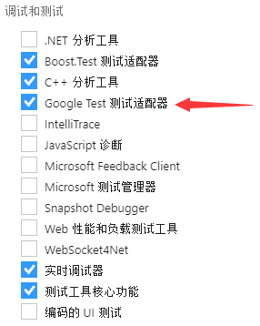
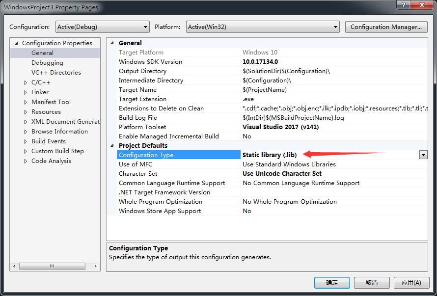
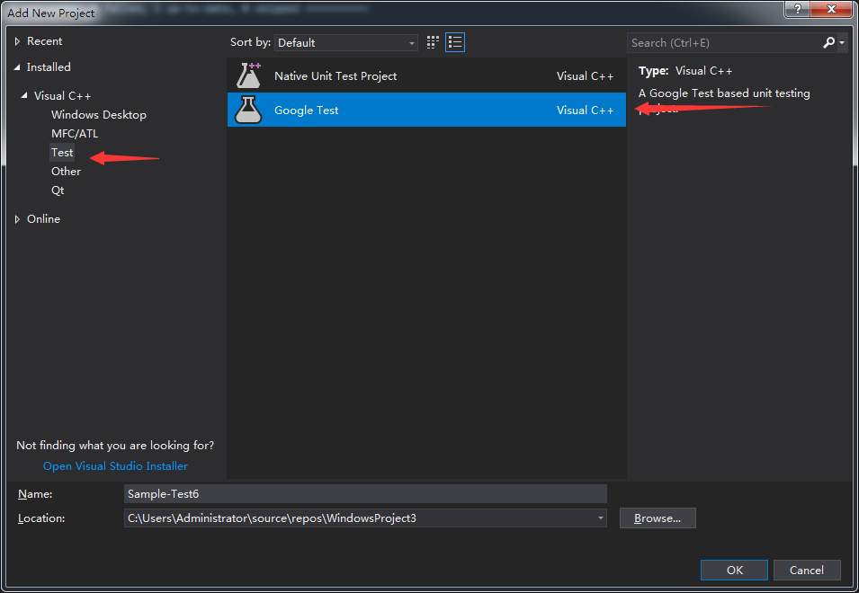
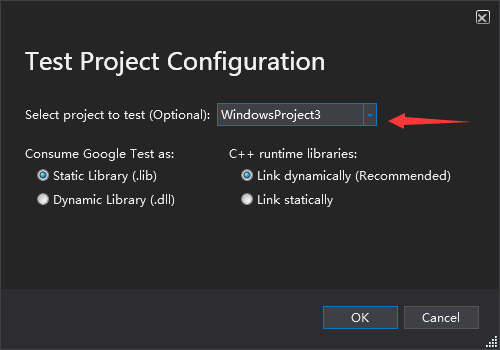
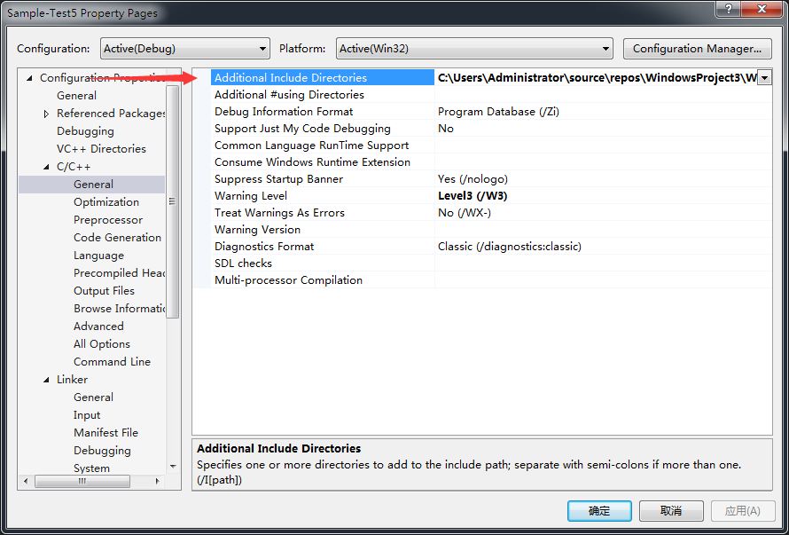

# VS 2017  Google test

### 添加对Google Test 的支持

VS 2017 已经添加了对Google Test 支持, 只需要在安装时勾选

## 创建待测试项目

创建项目, 不必多说

更改项目的设定, 右键property -> configuration type 改为.lib

### 创建Google Test 项目

在solution 右键Add, 选择Project. 继续选择Test中的Google Test

在向导中将待测试项目添加到Test项目里, 这样就可以访问待测试项目生成的lib之类的文件. 

如果这里没有添加待测项目, 也可以在Test项目中右键, Add, Reference 来添加引用

当然, 不同过引用也可以完成测试, 自己手动将lib 文件目录加进去, 既然有此选项, 省去自行寻找文件夹位置的时间也是极好的.

在默认生成的测试用例中, 发现并不能引用项目中的代码, 继续讲待测试项目中的头文件所在目录添加到Test 项目中.

剩下的就是编写TestCase 和 其中的每一个Test了. 看看文档即可.

##  运行测试

设定Test项目为startup project , Ctrl + F5 即可.

当然, 也可以用Test Explorer 来运行测试. Ctrl + E, T